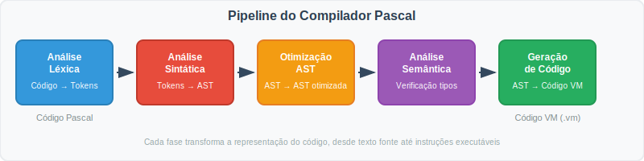
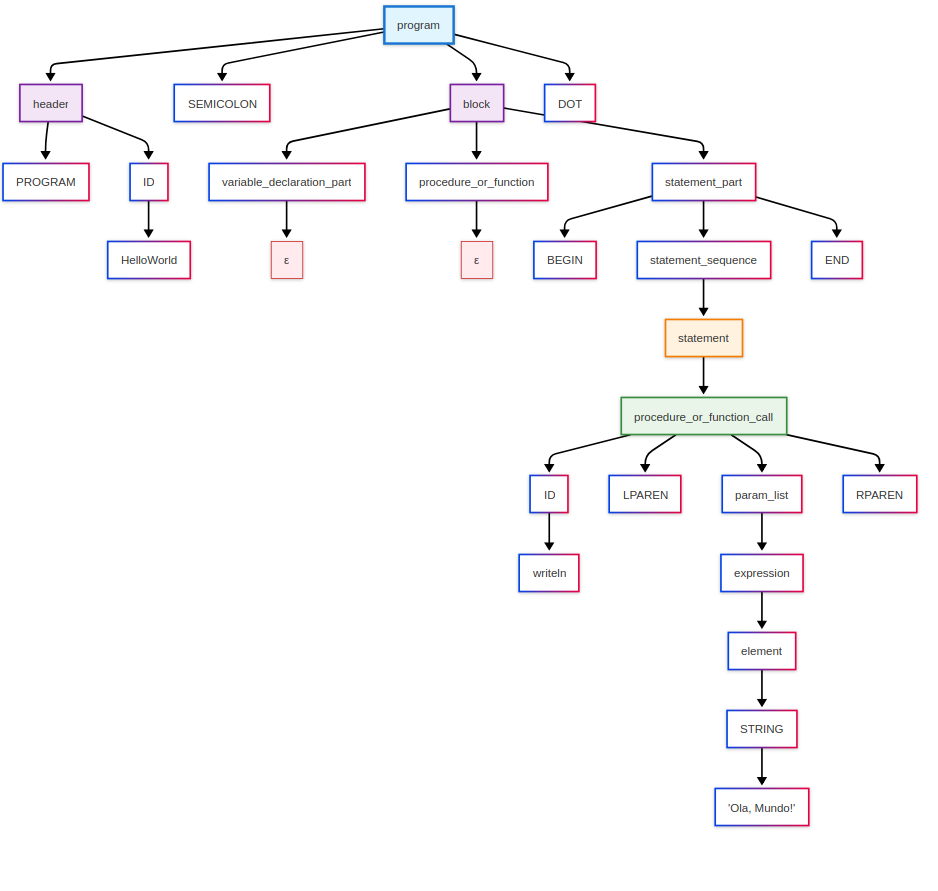

# Compilador de Pascal Standard em Python

## Introdução
Este projeto foi realizado com o objetivo de fazer um compilador para Pascal Standard usando a ferramenta ply do python. O compilador implementa uma pipeline completa de compilação, seguindo as fases clássicas de processamento de linguagens de programação:

- **Análise Léxica**: Transformação do código fonte em tokens (unidades léxicas)
- **Análise Sintática**: Verificação da gramática e construção da AST (Árvore Sintática Abstrata)
- **Otimização da AST**: Simplificação e otimização da árvore sintática
- **Análise Semântica**: Verificação de tipos, escopos e correção estática
- **Geração de Código**: Produção de código para máquina virtual stack-based

Começamos pelo analisador léxico, tendo sempre em conta os 7 testes de código Pascal que nos foram fornecidos, depois partimos para a escrita da gramática com construção da AST, que depois é otimizada. Em seguida, realizamos análise semântica para garantir a correção do programa, e por fim, geramos o código da máquina virtual.



Esta arquitetura modular permite uma separação clara de responsabilidades, facilitando a manutenção e extensão do compilador, além de seguir as melhores práticas da teoria de compiladores.

## Analizador Léxico
O analisador léxico, ou _lexer_, constitui a primeira fase do processo de compilação. A sua função principal é transformar o código fonte Pascal numa sequência de tokens (unidades léxicas), eliminando elementos desnecessários como espaços em branco e comentários, e identificando os diferentes tipos de símbolos que constituem a linguagem.
### Definição dos Tokens
A definição cuidadosa dos tokens foi fundamental para o sucesso do analisador léxico. Identificámos e categorizámos todos os elementos léxicos da linguagem Pascal Standard, organizando-os em grupos lógicos para facilitar o processamento posterior.

#### Tokens de Pontuação e Delimitadores
Os tokens de pontuação são essenciais para delimitar diferentes secções do código e definir a estrutura sintática:
```python
# Delimitadores principais
'DOT'           # .  (ponto final do programa)
'SEMICOLON'     # ;  (separador de instruções)
'COMMA'         # ,  (separador de elementos)
'COLON'         # :  (declaração de tipos)

# Parênteses e chavetas
'LPAREN'        # (  (abertura de parênteses)
'RPAREN'        # )  (fecho de parênteses)
'LBRACKET'      # [  (abertura de índices de array)
'RBRACKET'      # ]  (fecho de índices de array)
```
#### Operadores Aritméticos e de Atribuição
Os operadores matemáticos e de atribuição foram definidos considerando a precedência e associatividade típicas do Pascal:
```python
# Operadores aritméticos
'PLUS'          # +  (adição)
'MINUS'         # -  (subtração/negação)
'MULTIPLY'      # *  (multiplicação)
'DIVIDE'        # /  (divisão real)
'MOD'           # mod (módulo)
'DIV'           # div (divisão inteira)

# Atribuição
'ASSIGN'        # := (atribuição)
```

#### Operadores Relacionais e Lógicos
Para suportar as estruturas condicionais e de controlo, definimos um conjunto completo de operadores de comparação e lógicos:
```python
# Operadores de comparação
'EQ'            # =  (igual)
'NE'            # <> (diferente)
'LT'            # <  (menor que)
'LE'            # <= (menor ou igual)
'GT'            # >  (maior que)
'GE'            # >= (maior ou igual)

# Operadores lógicos
'AND'           # and (conjunção lógica)
'OR'            # or  (disjunção lógica)
'NOT'           # not (negação lógica)
```
#### Literais e Identificadores
A identificação correta de literais numéricos, strings e identificadores foi crucial para o funcionamento do compilador:
```python
# Literais
'INTEGER'       # números inteiros (ex: 42, -15)
'REAL'          # números reais (ex: 3.14, -2.5)
'STRING'        # cadeias de caracteres (ex: 'Hello World')
'BOOLEAN'       # valores booleanos (true, false)

# Identificadores
'ID'            # nomes de variáveis, funções, etc.
```
A distinção entre números inteiros e reais foi implementada com particular cuidado, uma vez que Pascal é uma linguagem com tipagem forte que requer conversões explícitas entre tipos numéricos diferentes.

### Expressões Regulares para Tokens Simples
Os tokens mais simples, como operadores e símbolos de pontuação, foram definidos através de expressões regulares directas. Esta abordagem permite um reconhecimento eficiente e claro dos elementos básicos da linguagem:

```python
# Operadores aritméticos
t_PLUS = r'\+'
t_MINUS = r'-'
t_TIMES = r'\*'
t_DIVIDE = r'/'

# Operadores relacionais (ordem importante para evitar conflitos)
t_LESSEQUAL = r'<='      # Deve vir antes de t_LESSTHAN
t_GREATEREQUAL = r'>='   # Deve vir antes de t_GREATERTHAN
t_DIFFERENT = r'<>'
t_LESSTHAN = r'<'
t_GREATERTHAN = r'>'
t_EQUALS = r'='

# Símbolos de pontuação
t_SEMICOLON = r';'
t_COMMA = r','
t_DOT = r'\.'
t_COLON = r':'
t_ASSIGN = r':='        

# Delimitadores
t_LPAREN = r'\('
t_RPAREN = r'\)'
t_LBRACKET = r'\['
t_RBRACKET = r'\]'
t_RANGE = r'\.\.'        # Para arrays (ex: [1..10])
```

É importante notar a ordem de definição de alguns tokens. Por exemplo, `t_LESSEQUAL` deve ser definido antes de `t_LESSTHAN` para evitar que <= seja interpretado como < seguido de =.

### Palavras Reservadas (Case-Insensitive)

Uma das características mais interessantes do Pascal é o facto de as palavras reservadas serem insensíveis a maiúsculas e minúsculas. Em vez de usar um dicionário tradicional, optámos por implementar cada palavra reservada como uma função individual com expressões regulares que capturam todas as variações possíveis de capitalização:

```python 
def t_PROGRAM(t):
    r'[pP][rR][oO][gG][rR][aA][mM]'
    return t

def t_BEGIN(t):
    r'[bB][eE][gG][iI][nN]'
    return t

def t_END(t):
    r'[eE][nN][dD]'
    return t
```
Esta abordagem, embora mais verbosa que um dicionário de palavras reservadas, oferece maior controlo e flexibilidade. Permite que código como `BEGIN`, `begin`, `Begin` ou `BeGiN` seja reconhecido uniformemente como o token `BEGIN`.

Segue exemplos das palavras reservadas implementadas (estruturas de controlo):

```python

def t_IF(t):
    r'[iI][fF]'
    return t

def t_WHILE(t):
    r'[wW][hH][iI][lL][eE]'
    return t

def t_FOR(t):
    r'[fF][oO][rR]'
    return t

```
### Identificadores e Literais
A identificação correcta de identificadores, números e strings é fundamental para qualquer compilador. A nossa implementação utiliza expressões regulares cuidadosamente definidas para capturar estes elementos:

#### Identificadores
```python
def t_ID(t):
    r'[a-zA-Z_][a-zA-Z0-9_]*'
    return t
```
Os identificadores seguem a convenção Pascal padrão: devem começar com uma letra ou underscore, seguidos de qualquer combinação de letras, dígitos ou underscores. Esta função é colocada após todas as palavras reservadas para garantir que estas tenham prioridade sobre identificadores genéricos.

#### Números (Inteiros e Reais)
```python
def t_NUMBER(t):
    r'\d+(\.\d+)?'
    if '.' in t.value:
        t.value = float(t.value)
    else:
        t.value = int(t.value)
    return t
```
Esta função reconhece tanto números inteiros quanto números reais, convertendo automaticamente o valor da string para o tipo Python apropriado (`int` ou `float`). Isto facilita o processamento posterior durante a análise sintática e semântica.

#### String (Frases)
```python
def t_PHRASE(t):
    r"'[^']*'"
    return t
```
s strings em Pascal são delimitadas por aspas simples. A expressão regular captura qualquer sequência de caracteres (excepto aspas simples) entre aspas simples.

#### Valores Booleanos 
```python
def t_BOOL(t):
    r'[tT][rR][uU][eE]|[fF][aA][lL][sS][eE]'
    t.value = (t.value.lower() == 'true')
    return t
```
Os valores booleanos true e false são reconhecidos de forma case-insensitive e convertidos automaticamente para valores booleanos Python (True ou False).


### Tratamento de Comentários e Espaços
O Pascal suporta dois tipos de comentários, ambos implementados no nosso analisador léxico:

```python
def t_COMMENT(t):
    r'\{[^}]*\}|\(\*[^*]*\*\)'
    pass  # Os comentários são ignorados
```
Esta função reconhece:
- Comentário com chavetas: `{ comentário }`
- Comentário com parênteses: `(* comentário *)`

Os comentários são simplesmente ignorados (através do pass), não gerando tokens para o analisador sintático.

Para o tratamento de espaços em branco e quebras de linha:
```python
def t_NEWLINE(t):
    r'\n+'
    t.lexer.lineno += len(t.value)

t_ignore = ' \t'  # Ignora espaços e tabs
```
As quebras de linha são capturadas para manter o controlo do número da linha atual (útil para mensagens de erro), enquanto espaços e tabs são simplesmente ignorados.

### Tratamento de Erros
O tratamento de erros léxicos é essencial para um compilador robusto:

```python
def t_error(t):
    print(f"Illegal character '{t.value[0]}' at line {t.lexer.lineno}")
    t.lexer.skip(1)
```

Quando o analisador léxico encontra um carácter que não consegue reconhecer, esta função:

1. Imprime uma mensagem de erro informativa com o carácter problemático e a linha onde ocorreu.

2. Avança um carácter (t.lexer.skip(1)) para tentar continuar a análise.

Esta abordagem permite que o compilador reporte múltiplos erros numa única execução, em vez de parar no primeiro erro encontrado.

### Teste do Lexer test_lexer(data): 
Para facilitar o desenvolvimento e depuração, implementámos uma função de teste que permite visualizar todos os tokens gerados:

```python
def test_lexer(data):
    lexer.input(data)
    tokens_list = []
    while True:
        tok = lexer.token()
        if not tok:
            break
        print(tok)
        tokens_list.append(tok)
    return tokens_list
```
Esta função é particularmente útil durante o desenvolvimento, permitindo verificar se o código Pascal está a ser tokenizado correctamente antes de passar para a fase de análise sintática.

## Analizador Sintático
O analisador sintático constitui uma das fases mais críticas do nosso compilador Pascal, sendo responsável por verificar se a sequência de tokens gerada pelo analisador léxico respeita as regras gramaticais da linguagem. Esta componente transforma a representação linear dos tokens numa estrutura hierárquica denominada _Árvore Sintática Abstrata (AST - Abstract Syntax Tree)_.

### Estrutura da Gramática

#### Definição de precedências
Para resolver ambiguidades em expressões, define-se a precedência e associatividade dos operadores com a variável precedence. Cada tuplo indica a associatividade ('left', 'right' ou 'nonassoc') e os tokens correspondentes. Por exemplo:

```python
precedence = (
    ('left', 'PLUS', 'MINUS'),
    ('left', 'TIMES', 'DIVIDE'),
    ('left', 'DIV', 'MOD'),
    ('left', 'EQUALS', 'DIFFERENT', 'LESSEQUAL', 'LESSTHAN', 'GREATERTHAN', 'GREATEREQUAL'),
    ('left', 'OR', 'AND'),
)
```
**Backup de segurança**: Embora a precedência seja gerida principalmente pela hierarquia gramatical (ver ponto 3 mais à frente), estas declarações servem como _fallback_ para casos não cobertos explicitamente, garantindo comportamento consistente.

A ordem dos tuplos define a precedência (de menor para maior), e 'left' indica que operadores com a mesma precedência são avaliados da esquerda para a direita. Isto garante que expressões como `a + b * c` são interpretadas corretamente, respeitando as convenções matemáticas.

#### Estrutura Hierárquica da Gramática

O analisador sintático implementa uma gramática livre de contexto para Pascal Standard, organizando as regras numa estrutura hierárquica que reflete a natureza recursiva da linguagem.

1. **Program (Axioma)**
```python
program : header SEMICOLON block DOT
```

Esta regra define a estrutura fundamental de um programa Pascal: um cabeçalho seguido de um bloco principal terminado com ponto final. A escolha desta estrutura top-down permite validar imediatamente se o ficheiro tem a estrutura básica esperada.

2. **Tratamento de Listas de Identificadores**
```python
def p_id_list(t):
    """id_list : ID
               | ID LBRACKET expression RBRACKET 
               | ID COMMA id_list
               | ID LBRACKET expression RBRACKET COMMA id_list"""
```
Esta regra resolve a ambiguidade entre arrays e listas de variáveis na declaração. Em Pascal, pode-se ter:

- `var a, b, c: integer;` (lista simples)
- `var arr: array[1..10] of integer` (array simples)
- `var arr1: array[1..5] of integer, arr2: array[1..3 of integer];` (múltiplos arrays)

A gramática distingue entre ID (identificador simples) e ID LBRACKET expression RBRACKET (definição de array).

3. **Hierarquia de Expressões com Precedência**
```python
def p_expression(t):
    """expression : expression and_or expression_m
                  | expression_m"""

def p_expression_m(t):
    """expression_m : expression_s
                   | expression_m sign expression_s"""

def p_expression_s(t):
    """expression_s : element
                   | expression_s psign element"""
```
Esta abordagem: 
- Nível 1 (expression): Operadores lógicos (`AND`, `OR`) - menor precedência
- Nível 2 (expression_m): Operadores relacionais e aritméticos (`+`,`-`, `=`, `<`, etc.)
- Nível 3 (expression_s): Operadores multiplicativos (`*`, `/`, `div`, `mod`) - maior precedência

4. **Gestão de Procedimentos e Funções**
```python
def p_procedure_or_function(t):
    """procedure_or_function : proc_or_func_declaration SEMICOLON procedure_or_function
                            | """
    
def p_block(t):
    """block : variable_declaration_part procedure_or_function statement_part 
             | variable_declaration_part procedure_or_function variable_declaration_part statement_part"""
```
Esta regra permite zero ou mais declarações de procedimentos/funções no bloco principal. A recursão à direita com alternativa vazia (ε-produção) permite que programas não tenham subprogramas, mantendo a compatibilidade com Pascal Standard.

**Problema crítico resolvido**: Declarações var após declarações de procedimentos/funções. No Exemplo 7 do enunciado:
```python
program BinarioParaInteiro;
function BinToInt(bin: string): integer;
var
    i, valor, potencia: integer;  // VAR dentro da função
begin
    // corpo da função
end;
var
    bin: string;                  // VAR após a função no programa principal
    valor: integer;
begin
    // programa principal
end.
```
**Solução implementada**: A regra block tem duas alternativas:

Forma simples: `var` → `procedures` → `begin...end`
Forma complexa: `var` → `procedures` → `var` → `begin...end`

Isto permite que após declarações de procedimentos/funções apareça uma nova secção var, essencial para a sintaxe padrão do Pascal onde variáveis globais podem ser declaradas depois dos subprogramas.

5. **Tratamento de arrays**
```python
def p_assignment_statement(t):
    """assignment_statement : ID ASSIGN expression
                            | ID ASSIGN procedure_or_function_call
                            | ID LBRACKET expression RBRACKET ASSIGN expression"""
```
Separação explícita entre atribuição simples e atribuição a arrays. Isto evita conflitos shift/reduce que surgiriam se tentássemos tratar `ID` e `ID[expr]` como casos do mesmo não-terminal.

6. **Estruturas de controlo**
```python
def p_for_statement(t):
    """for_statement : FOR assignment_statement TO expression DO statement
                    | FOR assignment_statement DOWNTO expression DO statement"""
```

Flexibilidade implementada: O ciclo for aceita tanto `TO` (incremento) como `DOWNTO` (decremento), capturando a semântica completa do Pascal. A inicialização através de `assignment_statement` permite validar que se trata de uma atribuição válida.

7. **Gestão de Conflitos Shift/Reduce**
Problema do _Dangling Else_:
```python 
def p_if_statement(t):
    """if_statement : IF expression THEN statement ELSE statement
                    | IF expression THEN statement"""
```
A regra com `ELSE` aparece primeiro, fazendo com que o parser PLY favoreça o shift sobre o reduce (associa o `ELSE` ao `IF` mais próximo). Isto resolve automaticamente a ambiguidade clássica do **"dangling else"**.

8. **Tratamento de Chamadas de Função vs Identificadores**
```python
def p_procedure_or_function_call(t):
    """procedure_or_function_call : ID LPAREN param_list RPAREN
                                 | ID LPAREN RPAREN
                                 | ID"""
```
Um ID isolado pode ser tanto um identificador quanto uma chamada de função sem parâmetros. A regra trata ambos os casos, deixando a resolução para a fase de análise semântica, onde se pode consultar a tabela de símbolos.

### Construção da Árvore Sintática Abstrata (AST)
A AST (Abstract Syntax Tree) é uma representação hierárquica simplificada da estrutura sintática do código fonte, eliminando detalhes irrelevantes (como símbolos de pontuação) e mantendo apenas a lógica essencial do programa.

No analisador sintático fornecido, a AST é construída a cada regra de produção usando classes específicas (como `Program`, `IfStatement`, `BinaryOp`, etc.), que herdam de uma classe base `ASTNode`.

1. **Estrutura da AST**

Cada nó da AST é um objeto que representa:

- **Declarações** (programas, variáveis, funções).

- **Comandos** (atribuições, loops, condicionais).

- **Expressões** (operações matemáticas, lógicas, chamadas de funções).

### Exemplos de nós comuns da AST:

| Classe (Nó)   | Exemplo em Pascal              | Representação na AST                                |
|---------------|-------------------------------|------------------------------------------------------|
| `Program`     | `program MeuProg; begin ... end.` | `Program(Header("MeuProg"), Block(...))`         |
| `IfStatement` | `if x > 0 then ... else ...`      | `IfStatement(BinaryOp(>, x, 0), ..., ...)`        |
| `BinaryOp`    | `a + b * c`                       | `BinaryOp(+, a, BinaryOp(*, b, c))`               |
| `Assignment`  | `x := 10`                         | `Assignment(Identifier("x"), Literal(10))`        |


## 2. **Construção Passo a Passo**

### (a) Regras de Produção → Nós da AST

Cada função `p_*` no analisador sintático:

- Recebe os tokens (`t[1]`, `t[2]`, etc.) da regra correspondente.
- Combina esses tokens em um objeto da AST e armazena em `t[0]`.

#### Exemplo 1: Atribuição (`:=`)

```python
def p_assignment_statement(t):
    """assignment_statement : ID ASSIGN expression"""
    t[0] = Assignment(Identifier(t[1]), t[3])  # Ex: x := 10 → Assignment("x", Literal(10))
```

#### Exemplo 2: Operação Binária (+, -, *, etc.)

```python
def p_expression_m(t):
    """expression_m : expression_m sign expression_s"""
    t[0] = BinaryOp(t[1], t[2], t[3])  # Ex: a + b → BinaryOp(a, +, b)
```
### (b) Hierarquia da AST
A AST é construída recursivamente, onde nós complexos contêm subárvores.

**Exemplo em Pascal**:

```pascal
if x > 0 then 
    y := x * 2 
else 
    y := 0
```
**AST gerada:**

```r
IfStatement(
    condition=BinaryOp(>, Identifier("x"), Literal(0)),
    then_part=Assignment(Identifier("y"), BinaryOp(*, Identifier("x"), Literal(2))),
    else_part=Assignment(Identifier("y"), Literal(0))
)
```

## Otimizador de AST
O otimizador percorre a Árvore Sintática Abstrata (AST) e aplica transformações para simplificar o código, removendo redundâncias e pré-calculando expressões sempre que possível.

### 1. Estrutura do Otimizador

- **Método principal**: optimize(node)

- Chama métodos específicos para cada tipo de nó (ex: `optimize_IfStatement`, `optimize_BinaryOp`).

- Se não houver um método específico, usa `generic_optimize` (que apenas retorna o nó sem modificações).

### 2. Tipos de Otimizações Realizadas

**(a) Simplificação de Expressões Constantes**

- 5 + 3 → 8

- true AND false → false

- "hello" + " " + "world" → "hello world"

**(b) Condicionais com condições constantes**:

- if true then X else Y → X

- if false then X else Y → Y

- while false do ... → (remove o loop inteiro)

**(c) Operações com valores neutros:**

- x + 0 → x

- x * 1 → x
 
- x AND true → x

**(d) Funções com parâmetros constantes**:

- Length("abc") → 3

**(e) Dupla negação**:

Ex: NOT (NOT x) → x

### 4. **Métodos Auxiliares**
`_parse_number`: Converte strings numéricas para int ou float.

`_strip_quotes`: Remove aspas de strings literais (ex: "abc" → abc).

`_nodes_equal`: Compara dois nós para verificar equivalência (usado em simplificações como x - x = 0).

### 5. Saída
A AST é modificada in-place, com nós substituídos por versões otimizadas.

Nós removidos (como loops mortos) são retornados como None e eliminados na etapa de reconstrução. 


## Analizador Semântico 
Este analisador semântico verifica a correção estática do código Pascal após a fase sintática, garantindo que:

- Todas as variáveis e funções estão declaradas antes do uso.

- Tipos de dados são compatíveis em operações, atribuições e parâmetros.

- Regras de escopo são respeitadas (ex: variáveis locais vs. globais).

- Estruturas de controle (if, while, for) têm condições booleanas válidas.

- Chamadas de funções/procedimentos têm a quantidade e tipos de parâmetros corretos.

### 1. Componentes Principais
#### (a) Tabela de Símbolos (SymbolTable)

- Armazena informações sobre variáveis, funções, procedimentos e arrays em escopos aninhados.


- Estrutura:

    `symbols`: Dicionário que mapeia nomes a objetos Symbol.

    `parent`: Referência ao escopo pai (para suporte a escopos aninhados).

#### (b) Símbolos (Symbol, ProcedureSymbol, ArraySymbol)

- `Symbol`: Representa variáveis simples (nome, tipo, se é constante, se foi inicializada).

- `ProcedureSymbol`: Armazena informações de funções/procedimentos (parâmetros, tipo de retorno).

- `ArraySymbol`: Guarda o tipo dos elementos e dimensões (ex: ARRAY [1..10] OF INTEGER).

#### (c) Regras de Compatibilidade de Tipos

- `type_compatibility`: Define quais tipos podem ser convertidos implicitamente (ex: INTEGER → REAL).

- `operator_rules`: Especifica os tipos válidos para cada operador (ex: + só funciona com INTEGER, REAL, ou STRING).

## Gerador de Código
Este módulo `(Generator)` é responsável por traduzir a AST (Árvore Sintática Abstrata) em **código de máquina virtual**, gerando um arquivo `.vm` que pode ser executado por uma **máquina virtual stack-based**.

#### 1. Funcionamento Geral
- **Entrada**: AST gerada pelo analisador semântico.

- **Saída**: Ficheiro `.vm` com instruções em uma linguagem de baixo nível (stack-based).

- **Objetivo**: Converter estruturas Pascal (variáveis, loops, funções) em operações de pilha e saltos condicionais.

#### 2. Componentes Principais
##### (a) Tabelas de Símbolos

- `stack`: Mapeia variáveis globais para posições na memória.

- `function_stack`: Mapeia variáveis locais (de funções) para posições na pilha.

- `types`: Armazena os tipos das variáveis (ex: integer, string).

##### (b) Contadores

- `op_stack_pos`: Controla a posição atual na pilha de operações.

- `loop_counter`, `if_counter`: Geram rótulos únicos para loops e condicionais.

##### (c) Flags de Estado
`in_function`: Indica se o gerador está processando uma função.

`has_function`: Indica se o programa tem funções/procedimentos.


## Exemplo Final: Do Código Pascal ao Código da Máquina Virtual

Para ilustrar o funcionamento completo do compilador, segue um exemplo simples com o clássico programa Pascal "Hello World".

### Código Fonte Pascal (`hello.pas`)

```pascal
program HelloWorld;
begin
    writeln('Ola, Mundo!');
end.
```
### Compilação
```text
Compiling file: ../tests/hello.pas

Phase 1: Lexical and syntax analysis...
Syntax analysis completed successfully.

Phase 2: AST Optimization...
PARAM
:Literal('Ola, Mundo!', PHRASE)
END
AST Optimization completed.

Phase 3: Semantic Analysis...
No semantic errors found.
Semantic analysis completed successfully.

Code generation completed
Compilation successful!
```
### Árvore de Decisão


### AST Otimizada
```python
Program(
  header=Header(
    program_name=HelloWorld
  ),
  block=Block(
    var_decl_part=VarDeclarationPart(
      declarations=[]
    ),
    proc_func_part=[],
    extra_var_decl=None,
    statement_part=StatementPart(
      statement_sequence=StatementSequence(
        statements=[
          WritelnStatement(
            params=[
              Literal(
                type_name=PHRASE,
                value='Ola, Mundo!'
              )
            ]
          )
        ]
      )
    )
  )
)
```

### Código Gerado para a Máquina Virtual
```asm
pushs "Ola, Mundo!"
writes
writeln
```
| Instrução             | Descrição                                                                                   |
| --------------------- | ------------------------------------------------------------------------------------------- |
| `pushs "Ola, Mundo!"` | Armazena a string `"Ola, Mundo!"` no *String Heap* e empilha o seu endereço.                |
| `writes`              | Retira o endereço da string do topo da pilha e escreve o seu conteúdo (a string) no output. |
| `writeln`             | Imprime uma quebra de linha (`\n`) após a string.                                           |


## Conclusão
Embora tenhamos concluído o projeto com muitas funcionalidades, notamos que como o Pascal é uma linguagem com muitas particularidades poderíamos sempre melhorar ou adicionar mais alguma coisa, como lidar com apontadores, maior variedade possibilidades na geração de código, etc. No entanto, consideramos este projeto uma grande oportunidade de aprendizagem não só sobre Pascal, mas também linguagens de programção em geral.
