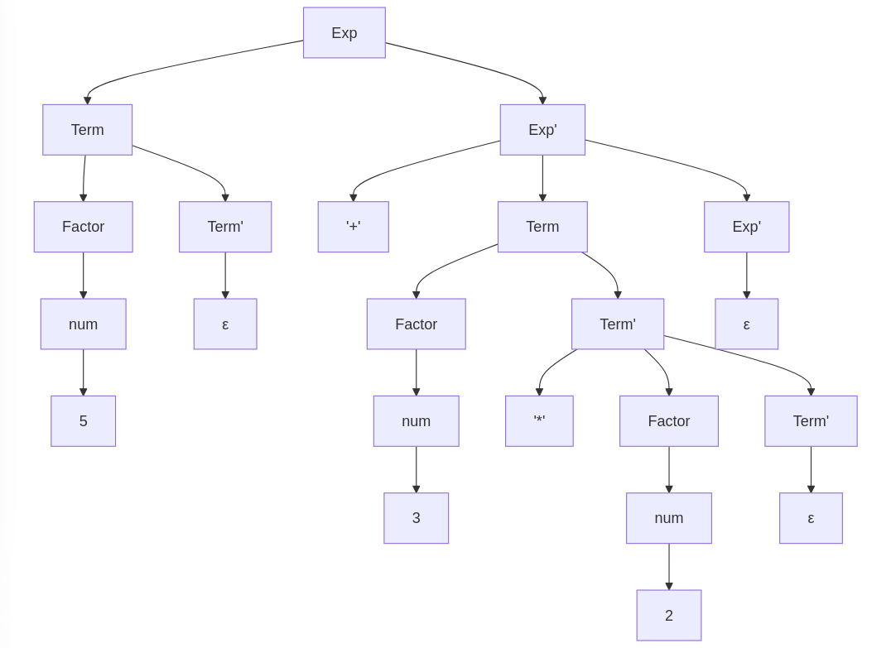
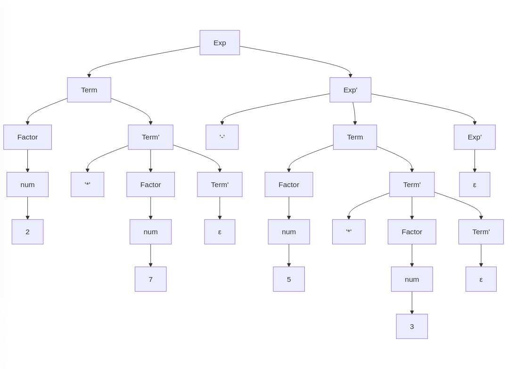

# PL 2024/25 - TPC 6

## Data
**17 de março de 2025**

## Autoria
**Nome:** Rodrigo Miguel Granja Ferreira  
**Número mecanográfico:** A104531  


## Resumo
O TPC6 consistiu na implementação de um parser recursivo descendente para expressões aritméticas, como `5 + 3 * 2` e `2 * 7 - 5 * 3` em Python, utilizando a biblioteca **PLY (Python Lex-Yacc)** para a análise léxica. O parser é capaz de processar expressões com operadores de adição, subtração e multiplicação, respeitando a precedência de operadores.

## Implementação
### Estrutura do Parser
O parser foi implementado utilizando a técnica de análise sintática recursiva descendente, baseada na seguinte gramática:

```python
Exp   → Term Exp'
Exp'  → ('+' | '-') Term Exp' | ε
Term  → Factor Term'
Term' → ('*') Factor Term' | ε
Factor → num
```

### Analisador léxico
O analisador léxico define os tokens da linguagem:
```python
tokens = ('NUM','PLUS','MINUS','TIMES')
t_NUM = r'\d+'
t_PLUS = r'\+'
t_MINUS = r'-'
t_TIMES = r'\*'
```

### Funções de parsing

- **rec_Factor():** Analisa números
- **rec_Term():** Processa fatores e multiplicações
- **rec_Exp():** Processa termos e adições/subtrações
- **rec_Parser():** Função principal que inicia o parsing

### Precedência de Operadores

A precedência de operadores é implementada através da estrutura hierárquica da gramática:
- Operadores de multiplicação ('*') têm maior precedência e são processados em níveis mais baixos (Term)
- Operadores de adição/subtração (+/-) têm menor precedência e são processados em níveis mais altos (Exp)

### Árvores de decisão
#### Exemplo 1: 5 + 3 * 2

Para este exemplo, a árvore de decisão considera a precedência dos operadores. O operador de multiplicação (*) tem maior precedência que a adição (+), então a multiplicação é processada primeiro. Neste caso, a multiplicação de 3 * 2 é calculada primeiro, resultando em 6, e depois a adição 5 + 6 é realizada, resultando em 11. A árvore de decisão é construída como segue:



#### Exemplo 2: 2 * 7 - 5 * 3
Para este exemplo, a árvore de decisão respeita a precedência dos operadores de multiplicação e adição/subtração. A multiplicação é processada antes da subtração. Aqui, as multiplicações 2 * 7 e 5 * 3 são feitas primeiro, resultando em 14 e 15, respectivamente. Depois, a subtração 14 - 15 é realizada, resultando em -1. A árvore de decisão é construída como segue:



### Exemplos de execução

```shell
>> 5 + 3 * 2
5 + 3 * 2 = 11

>> 2 * 7 - 5 * 3
2 * 7 - 5 * 3 = -1
```

## Conclusão
O parser recursivo descendente foi implementado com sucesso, permitindo a avaliação de expressões aritméticas com precedência de operadores. A estrutura modular facilita futuras extensões, como adicionar novos operadores ou implementar expressões mais complexas.